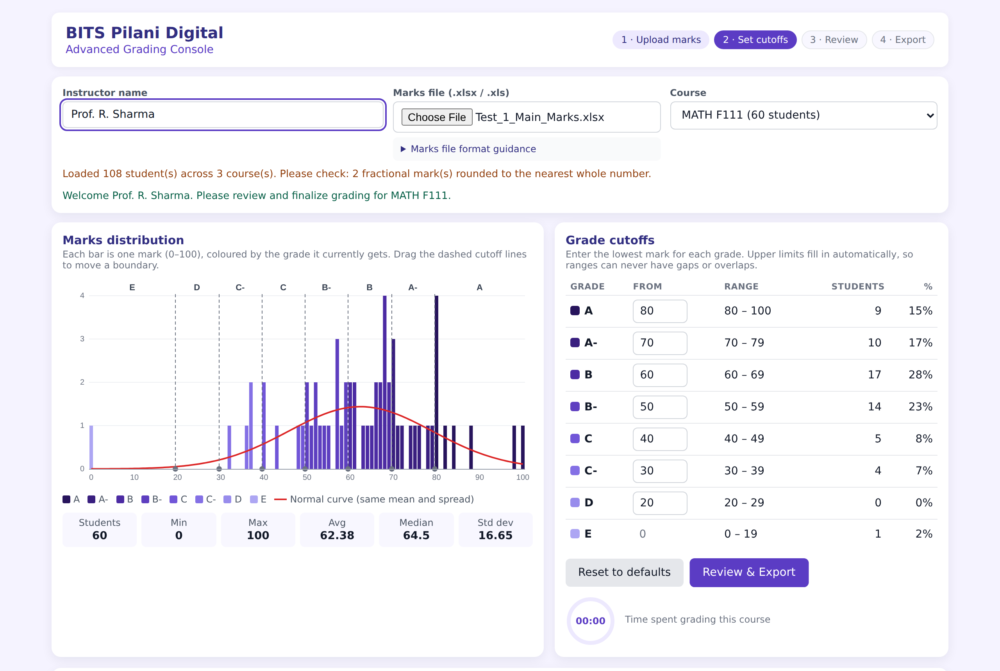
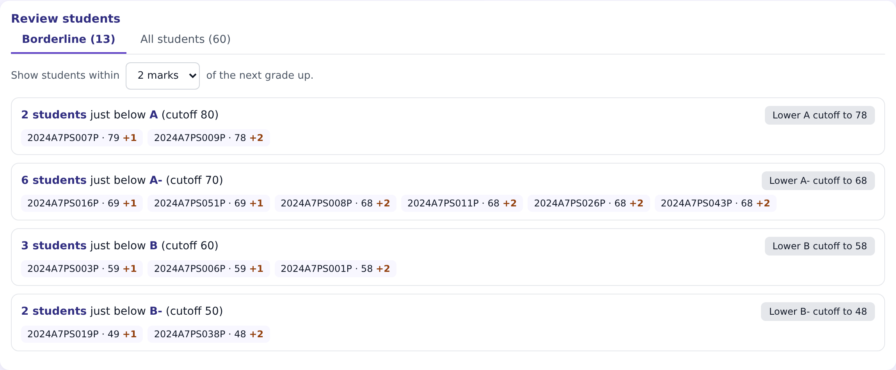
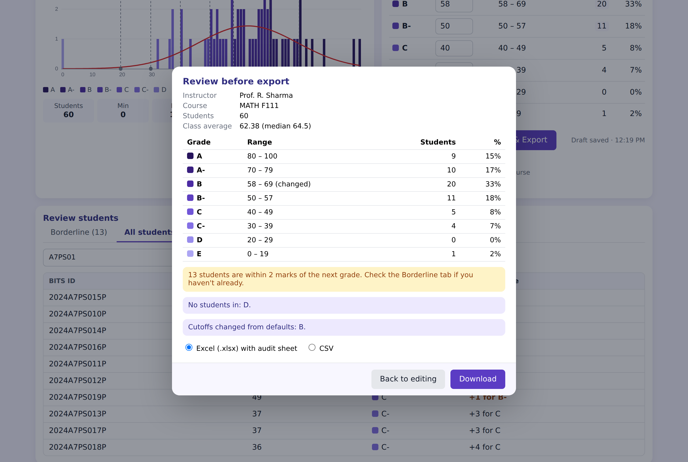
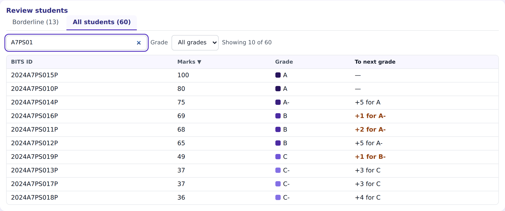
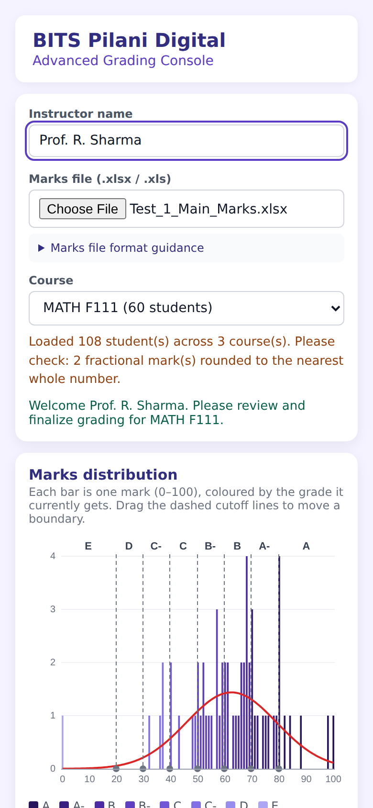

# Advanced Grading Console – BITS Digital CodeForge V1.0

My submission for the BITS Digital CodeForge challenge: the sample grading console, **debugged, reimagined and deployed**.

> The original was a practice prototype created for this challenge. It is **not** an official BITS Pilani Digital tool and is not used for real academic grading.

**Live app:** : https://dartiondev.github.io/CodeForge-Challenge/



---

## Submission at a glance

| Challenge stage | Where to find it |
|---|---|
| Stage 1 – Debug | [Bug Fix Log (Markdown)](docs/BUG_FIX_LOG.md) · [Bug Fix Log (PDF)](docs/Bug_Fix_Log.pdf) · fixes-only code: [`versions/v1-bugfix.html`](versions/v1-bugfix.html) |
| Stage 2 – Reimagine | [Enhancements summary](docs/ENHANCEMENTS.md) · final app: [`index.html`](index.html) |
| Stage 3 – Deploy | Live link above (GitHub Pages) |
| Testing | Four Excel test files in [`test-files/`](test-files). Each has a "How to test" sheet. |

## What I did

### Stage 1 – Fixed 19 bugs

Some of these changed the actual grades. For example:

- A student with 79.5 marks silently dropped out of the export.
- Lowering A's max to 95 removed every student above 95 with no warning.
- The Min and Max stats were swapped.
- Marks stored as text in Excel produced an average of 202363.33.

Other bugs affected reliability: duplicate courses in the dropdown, a timer that started when the page loaded, CSV files that broke on names with commas, and a crash when cancelling the file picker.

Every bug was reproduced on the original file first, then retested after the fix. Details are in the [Bug Fix Log](docs/BUG_FIX_LOG.md).

### Stage 2 – Seven enhancements, each solving a real instructor problem

1. **Cutoff-only editing.** You type the lowest mark for each grade and the ranges fill in, so gaps and overlaps can't happen.
2. **Colour-coded histogram.** One bar per mark, coloured by grade. You can drag the cutoff lines, and hovering shows details.
3. **Borderline students.** Shows who is 1–5 marks short of the next grade, with a one-click button to move the cutoff.
4. **Student table.** Search by BITS ID, filter by grade, sort, and see the gap to the next grade.
5. **Review before export.** A summary to check before anything downloads.
6. **Excel export with an Audit sheet.** Records who graded, when, and with which cutoffs. CSV is still available.
7. **Autosave.** Cutoffs are saved per course, so a refresh doesn't lose work.

Why each one matters: [docs/ENHANCEMENTS.md](docs/ENHANCEMENTS.md)

| Borderline review | Review before export |
|---|---|
|  |  |

| Student table | Mobile |
|---|---|
|  |  |

## Try it

1. Open the live link, or download this repo and double-click `index.html`. An internet connection is needed to load the Excel library.
2. Enter an instructor name.
3. Upload [`test-files/Test_1_Main_Marks.xlsx`](test-files/Test_1_Main_Marks.xlsx).
4. Pick **MATH F111**.
5. Change a cutoff, check the Borderline tab, then click **Review & Export**.

Input file format: first sheet, three columns `BITS ID`, `Course`, `Total Marks` (0–100). Students getting NC are left out. There's a blank template link in the app's "Marks file format guidance".

## Project structure

```
├── index.html                 ← the final app (this is what GitHub Pages serves)
├── versions/
│   ├── v0-original.html       ← original buggy code, kept for comparison
│   └── v1-bugfix.html         ← Stage 1 only: bug fixes, each marked "FIX #n"
├── docs/
│   ├── BUG_FIX_LOG.md / Bug_Fix_Log.pdf
│   ├── ENHANCEMENTS.md
│   └── screenshots/
└── test-files/                ← 4 Excel files for checking the fixes in a browser
```

## Tech

A single HTML file with plain JavaScript, a canvas chart, and [SheetJS](https://sheetjs.com/) `xlsx@0.18.5` (pinned) for reading and writing Excel. There's no build step and no server. Everything runs in the browser, and marks never leave the instructor's machine. Autosave uses the browser's `localStorage` only.

· built with help from AI tools - Claude for restructuring and reframing the content (as the challenge allows). Every change was tested against the Excel files in `test-files/`.
